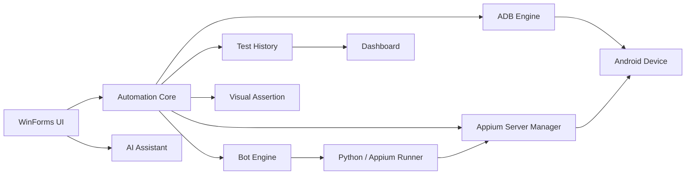

# Appium Builder Reborn

> **Android QA 자동화의 준비, 실행, 기록, 분석 과정을 하나의 Windows Desktop Application으로 통합한 개인 프로젝트입니다.**

[](https://github.com/ghdtmd4117/Appium_Builder_Reborn/actions/workflows/ci.yml)


Appium Builder Reborn은 ADB Device 관리, Appium Server 제어, Scenario 실행, Logcat, Screenshot/Recording, Visual Assertion, Test History, Dashboard, AI 기반 Scenario 작성 지원을 하나의 데스크톱 작업 흐름으로 묶은 QA Automation Tool입니다.

<table>
<tr>
<td width="50%"></td>
<td width="50%"></td>
</tr>
<tr>
<td width="50%"></td>
<td width="50%"></td>
</tr>
</table>

---

## 프로젝트를 만든 이유

Android QA 자동화를 진행하면서 다음 작업들이 서로 다른 도구와 Terminal에 흩어져 있었습니다.

```text
ADB Device 확인
  → Appium Server 실행
  → Scenario 준비
  → Automation 실행
  → Log / Screenshot / Recording 확인
  → PASS / FAIL 분석
  → 실행 이력 관리
```

반복적인 준비 작업과 결과 확인을 하나의 작업 흐름으로 줄이는 것을 목표로, 실제 Device에서 사용하면서 기능과 UI를 반복 개선했습니다.

---

## 핵심 기능

| 영역 | 기능 |
|---|---|
| **Device** | ADB Device 탐지, 상태 확인, Multi-device 선택 및 `adb -s` routing |
| **Appium** | Server 상태 확인, 시작/종료, Health Check, 외부 Server 보호 |
| **Automation** | Scenario 작성/저장, Step 실행, Batch 실행, PASS / FAIL / SKIPPED 기록 |
| **Log & Media** | 실시간 Logcat, 필터링, Screenshot, Screen Recording |
| **Visual Assertion** | Baseline, Threshold, Dynamic Mask, 실행 결과 비교 |
| **History** | Step/Run 이력, Artifact 연결, Backup 및 atomic replace |
| **AI Assistant** | UI Dump redaction 후 Gemini 기반 Scenario 작성 지원 |
| **Dashboard** | 테스트 실행 횟수, 결과, 성공률, 최근 실행 이력 확인 |

---

## Architecture



세부 책임과 실행 흐름은 [`docs/ARCHITECTURE.md`](docs/ARCHITECTURE.md)에 정리했습니다.

---

## 주요 구현 포인트

### 1. Appium Server lifecycle과 process ownership

Application이 시작한 Appium process와 사용자가 별도로 실행한 Server를 구분합니다.

```text
Health Check
  ├─ 외부 Server 실행 중 → 그대로 사용
  └─ Server 없음 → Appium Builder가 Terminal 실행
                         ↓
                   Healthy 확인
                         ↓
                   Automation 실행
```

`Appium Builder`가 소유한 process만 종료하기 때문에 외부 개발 환경을 임의로 종료하지 않습니다.

### 2. Multi-device ADB routing

연결된 Device를 파싱하고 선택한 Device에 대해 대부분의 command를 다음 형태로 실행합니다.

```text
adb -s <serial> <command>
```

`devices`, `connect`, `kill-server`처럼 Device에 종속되지 않는 command는 global command로 분리했습니다.

### 3. Test History 안전 저장

실행 이력을 바로 덮어쓰지 않고 다음 순서로 저장합니다.

```text
Temporary Write
  → Flush to Disk
  → JSON Validation
  → Backup
  → Atomic Replace
```

저장 중 비정상 종료가 발생하더라도 기존 정상 이력을 복구할 가능성을 높이기 위한 구조입니다.

### 4. Responsive WinForms UI

초기 fixed-size layout에서 발생했던 DPI/해상도별 clipping 문제를 개별 Width/Height 보정이 아닌 layout 구조로 해결했습니다.

- DPI 기준 logical pixel scaling
- `TableLayoutPanel` / `FlowLayoutPanel`
- `AutoSize`, `MinimumSize`, `AutoScroll`
- 좁은 창에서 Sidebar compact mode
- 카드 column reflow 및 vertical stacking

### 5. AI 입력 데이터 Redaction

Gemini API에 UI Dump를 전달하기 전 이메일, 전화번호, 긴 숫자 패턴 등을 Redaction하여 불필요한 개인정보 전달을 줄이도록 구성했습니다.

더 자세한 설계 배경은 [`docs/DESIGN_DECISIONS.md`](docs/DESIGN_DECISIONS.md)에서 확인할 수 있습니다.

---

## 기술 스택

| 기술 | 사용 목적 |
|---|---|
| **C# / .NET 8** | Application Core |
| **WinForms** | Windows Desktop UI |
| **ADB** | Android Device 탐지 및 제어 |
| **Appium** | Android UI Automation |
| **Python** | Appium Runner / Dashboard |
| **OpenCV** | Visual Assertion |
| **Gemini API** | AI 기반 Scenario 작성 지원 |
| **xUnit / pytest** | Core / Dashboard regression test |

---

## Repository 구조

```text
Appium_Builder_Reborn/
├─ Core/                   # ADB, Appium, Bot, History, Visual Assert
├─ MainForm/               # 화면 구성 및 responsive layout
├─ UI/                     # 공통 WinForms controls / dialogs
├─ Utils/                  # Secret, Device selection, global settings
├─ Dashboard/              # Python dashboard + web assets
├─ Tests/                  # xUnit / Python tests
├─ docs/                   # Architecture / Testing / Design decisions
├─ AppiumBuilder.csproj
├─ AppiumBuilder.slnx
├─ Program.cs
├─ requirements.txt
├─ .editorconfig
└─ .gitignore
```

---

## 실행 환경

- Windows 10/11
- .NET 8 SDK / Runtime
- Android Platform Tools (`adb`)
- Node.js + Appium
- Python
- USB Debugging이 활성화된 Android Device

### 1. 저장소 Clone

```powershell
git clone https://github.com/ghdtmd4117/Appium_Builder_Reborn.git
cd Appium_Builder_Reborn
```

### 2. Python dependency 설치

```powershell
python -m pip install -r requirements.txt
```

### 3. 환경 확인

```powershell
adb devices -l
appium --version
```

### 4. Application 실행

Visual Studio에서 `AppiumBuilder.slnx` 또는 `AppiumBuilder.csproj`를 열어 실행합니다.

CLI에서는 Windows 환경에서 다음과 같이 build할 수 있습니다.

```powershell
dotnet build AppiumBuilder.csproj
```

---

## Tests

### .NET

```powershell
dotnet test Tests/AppiumBuilder.Tests.csproj
```

### Python Dashboard

```powershell
python -m pytest Tests/python -q
```

테스트 대상과 실제 Device 검증 범위의 차이는 [`docs/TESTING.md`](docs/TESTING.md)에 명시했습니다.

---

## 보안 / 공개 범위

이 저장소에는 포트폴리오 및 코드 리뷰 목적으로 공개 가능한 Application source를 포함합니다. 다음 데이터는 Repository에 저장하지 않습니다.

- Gemini API Key
- 실제 Device Serial 및 개인 PC 경로
- Runtime Log / Test History
- Screenshot / Recording Artifact
- 로컬 Device 선택 정보

관련 runtime 파일은 `.gitignore`에서 제외합니다.

---

## 현재 한계

- Windows / WinForms 환경을 기준으로 개발했습니다.
- 실제 Device, Appium CLI 및 대상 Application 상태에 따라 통합 테스트 결과가 달라질 수 있습니다.
- 다양한 제조사 Device와 모든 Windows DPI 조합에 대한 완전한 호환성을 보장하지 않습니다.
- CI에서 Android 실기기를 연결한 end-to-end test까지 수행하는 구조는 아직 포함하지 않았습니다.

---

## 프로젝트 발전 과정

```text
기능 중심 Prototype
  → ADB / Appium Automation
  → Scenario Runner
  → Step Result / Test History
  → Dashboard / Log & Media
  → Visual Assertion
  → AI Assistant
  → Soft Blue Office UI
  → Appium Server Lifecycle
  → Responsive UI
```

이 프로젝트에서 중요하게 본 것은 기능 수 자체보다 **실제 사용 중 발생한 문제를 구조적으로 다시 설계하는 과정**입니다.

---

## Engineering Docs

- [Architecture](docs/ARCHITECTURE.md)
- [Design Decisions](docs/DESIGN_DECISIONS.md)
- [Testing Strategy](docs/TESTING.md)
- [Responsive UI Notes](docs/RESPONSIVE_UI.md)

---

### 개인 프로젝트 · Android QA Automation Platform
