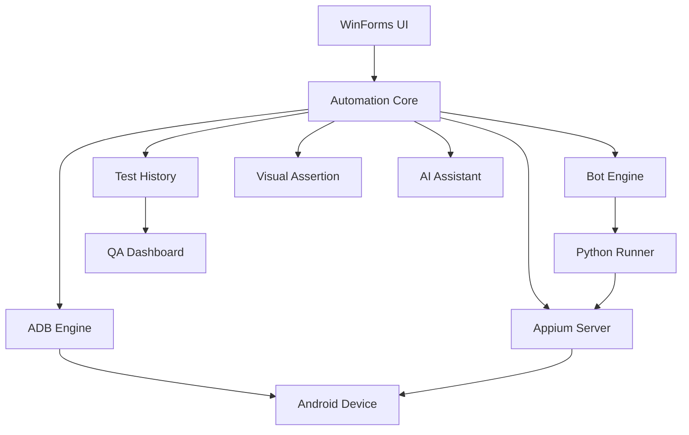

# Appium Builder Reborn

### Android QA 자동화 데스크톱 플랫폼

> **Android QA 자동화 과정에서 반복되는 작업을 하나의 Workflow로 통합하기 위해 직접 설계하고 개발한 Desktop QA Automation Platform입니다.**

시나리오 작성부터 Android Device 연결, Appium Server 실행, 자동화 테스트, Logcat 확인, 화면 녹화, PASS / FAIL 분석까지 하나의 프로그램에서 처리할 수 있도록 구성했습니다.


---

## 📌 프로젝트 소개

모바일 QA 자동화를 진행할 때 여러 도구와 Terminal을 오가며 작업해야 하는 불편함이 있었습니다.

예를 들어 테스트 하나를 실행하기 위해서도 다음과 같은 작업이 필요했습니다.

* Android Device 연결 상태 확인
* ADB 명령 실행
* Appium Server 실행
* 자동화 Scenario 작성
* Python / Appium Runner 실행
* Logcat 확인
* Screenshot 및 Screen Recording
* 테스트 성공 / 실패 여부 확인
* 실패 원인 분석
* 실행 결과 및 이력 관리

이러한 반복 작업을 하나의 프로그램에서 처리할 수 있다면 QA 자동화 작업의 흐름을 단순화할 수 있다고 판단했습니다.

그래서

> **Scenario 작성 → Appium 실행 → Android 자동화 → 결과 분석**

과정을 하나의 Desktop Application으로 통합한 **Appium Builder Reborn**을 개발했습니다.

---

## 🎬 데모

<!-- 실제 GIF를 추가한 뒤 주석을 제거하세요. -->


기본적인 자동화 실행 흐름은 다음과 같습니다.

```text
Android Device 연결
        ↓
Appium Server 시작
        ↓
자동화 Scenario 작성 / 선택
        ↓
Appium Bot 실행
        ↓
Android Device 자동 제어
        ↓
Step별 결과 확인
        ↓
PASS / FAIL / SKIPPED 판정
        ↓
Log / Screenshot / Recording / History 저장
```

---

# ✨ 주요 기능

## 🤖 Appium Bot

GUI 환경에서 Android 자동화 Scenario를 작성하고 실행할 수 있습니다.

* 자동화 Scenario 작성
* Scenario 저장 및 검색
* Step 단위 실행
* Batch Scenario 실행
* PASS / FAIL / SKIPPED 결과 관리
* 실행 중 Live Log 확인
* Step별 Screenshot 저장
* 전체 테스트 Screen Recording
* 실행 결과 및 Artifact 관리

---

## 📱 Android Device 관리

ADB를 통해 연결된 Android Device를 자동으로 탐지하고 상태를 확인합니다.

* 연결된 Device 자동 탐지
* Device Serial 관리
* Multi Device 지원
* Android Version 확인
* Device Model 확인
* `adb -s <serial>` 기반 Device 개별 제어
* `unauthorized`, `offline` 상태 감지

---

## ⚡ Appium Server 제어

기존에는 Appium Server를 별도의 Terminal에서 직접 실행해야 했습니다.

이를 개선하여 Application 내부에서 Appium Server의 상태와 Process를 관리할 수 있도록 구현했습니다.

```text
Server 상태 확인
      ↓
Appium Process 실행
      ↓
Health Check
      ↓
Automation 실행
      ↓
Process 종료
```

주요 기능:

* Appium Server 실행 상태 감지
* Server 시작 / 종료
* Appium Terminal 확인
* Bot 실행 전 Server Health Check
* Appium 중복 실행 방지
* 외부에서 실행된 Appium Server 감지
* Application이 실행한 Process와 외부 Process 분리 관리

외부에서 사용자가 직접 실행한 Appium Server는 감지만 하며 Application에서 임의로 종료하지 않도록 구성했습니다.

---

## 📊 테스트 Dashboard

테스트 실행 결과를 한눈에 확인할 수 있는 Dashboard를 제공합니다.

* 전체 실행 횟수
* PASS
* FAIL
* 성공률
* 최근 실행 이력
* Device 상태
* Appium Server 상태

---

## 📝 Log & Media

Android Device의 Log와 Media 기능을 하나의 화면에서 관리합니다.

### Logcat

* 실시간 ADB Logcat
* Log Level Filtering
* Keyword 검색
* 로그 일시정지
* 로그 저장
* 메모리 사용량을 고려한 최대 Line 제한

### Media

* Screenshot
* Screen Recording
* Recording Process 상태 추적
* 테스트 Artifact 저장

---

## 👁 Visual Assertion

OpenCV 기반의 화면 비교 기능을 통해 UI 테스트 결과를 검증할 수 있습니다.

* Visual Baseline 관리
* Baseline 이미지 비교
* Threshold 설정
* Dynamic Area Mask
* Difference 분석
* 테스트 Step 결과와 Visual Artifact 연결

---

## ✨ AI Assistant

AI를 활용하여 QA 자동화 Scenario 작성과 실패 분석을 지원합니다.

* 현재 화면 분석
* UI Element 분석
* 자동화 Scenario 생성 지원
* 테스트 실패 원인 분석
* QA Test Data 생성 지원
* 개인정보 및 민감정보 Redaction 처리

---

## 🕘 테스트 실행 이력

테스트 결과를 단순히 화면에 출력하는 것이 아니라 실행 이력으로 관리합니다.

관리되는 주요 정보:

* Scenario
* 실행 시간
* 실행 결과
* Step별 결과
* 소요 시간
* Screenshot
* Recording
* Error
* Artifact

CSV / JUnit / HTML 등의 결과 Export도 지원합니다.

---

# 🏗 시스템 구조



Appium Builder Reborn은 단순한 GUI Wrapper가 아니라 UI, Android Device 제어, Appium Process, 자동화 Runner, 실행 결과 저장을 각각 분리하여 관리하도록 구성했습니다.

---

# 🖥 주요 화면

## Home Dashboard


현재 Device와 Appium Server의 상태를 확인하고 테스트 실행 현황을 한눈에 확인할 수 있습니다.

주요 정보:

* Device 연결 상태
* Android Version
* Appium Server 상태
* 전체 테스트 실행 결과
* 최근 실행 이력
* 주요 기능 Quick Action

---

## Log & Media


ADB Logcat을 실시간으로 확인하고 Screenshot 및 Screen Recording을 관리하는 화면입니다.

---

## Utility


Android QA 과정에서 반복적으로 사용하는 기능을 Utility 형태로 통합했습니다.

* Screenshot
* UI Dump
* Screen Recording
* Android / ADB 상태 확인
* 환경 진단

---

## Appium Bot


프로젝트의 핵심 Workspace입니다.

```text
AI Assistant
      +
Scenario 관리
      +
Scenario Flow
      +
Live Execution Log
      +
Manual Step Builder
      +
Execution Control
```

Scenario 작성부터 실제 Android 자동화 실행 결과 확인까지 하나의 화면에서 처리할 수 있도록 구성했습니다.

---

# 🔧 주요 구현 포인트

## 1. Appium Server Lifecycle 관리

초기에는 Appium Server를 사용자가 별도의 Terminal에서 직접 실행해야 했습니다.

이 방식은 다음과 같은 문제가 있었습니다.

* Server 실행 여부를 사용자가 직접 확인해야 함
* Server를 실행하지 않고 Bot을 실행할 수 있음
* Appium 중복 실행 가능
* 실행 중인 Terminal을 별도로 관리해야 함

이를 해결하기 위해 Application에서 Appium Server의 Lifecycle을 관리하도록 개선했습니다.

```text
Appium Server 확인
        ↓
실행되지 않음
        ↓
사용자 확인
        ↓
Appium Process 시작
        ↓
Health Check
        ↓
Bot 실행
```

또한 Process Ownership을 구분하여 외부에서 실행된 Appium Server는 Application이 임의로 종료하지 않도록 처리했습니다.

---

## 2. 실제 Scenario 단위 자동화 실행

단순한 Demo 형태의 실행이 아니라 저장된 Scenario를 실제로 순차 실행하도록 구성했습니다.

```text
Scenario A
 ├─ Step 1   PASS
 ├─ Step 2   PASS
 └─ Step 3   FAIL

Scenario B
 └─ SKIPPED
```

테스트 결과를 Scenario와 Step 단위로 분리하여 관리하기 때문에 어느 단계에서 문제가 발생했는지 확인할 수 있습니다.

---

## 3. 안전한 테스트 이력 저장

테스트 실행 중 Application 또는 System이 비정상 종료될 경우 JSON History 파일이 손상될 가능성이 있었습니다.

이를 방지하기 위해 저장 방식을 개선했습니다.

```text
Temporary File Write
        ↓
Validation
        ↓
Backup
        ↓
Atomic Replace
```

기존 데이터의 Backup을 유지하여 저장 중 문제가 발생하더라도 이전 테스트 이력을 복구할 수 있도록 설계했습니다.

---

## 4. Logcat Memory 관리

실시간 Logcat을 장시간 실행할 경우 UI와 Memory에 로그가 계속 누적되는 문제가 발생할 수 있습니다.

이를 방지하기 위해:

* 내부 Log Line 최대 개수 제한
* UI 출력 Line 최대 개수 제한
* 필요 없는 이전 Log 자동 제거

방식을 적용했습니다.

---

## 5. Responsive WinForms UI

초기 버전은 고정 Pixel 중심의 Layout을 사용했습니다.

실제 다양한 Window Size와 Windows DPI 환경에서 테스트하면서 다음과 같은 문제가 발생했습니다.

* Button Text Clipping
* Label Text Clipping
* Card Overlap
* Control 높이 불일치
* DPI 변경 시 Layout Collapse

초기에는 문제가 발생할 때마다 Control의 Width / Height를 조정했습니다.

하지만 이 방식은 특정 화면에서는 해결되더라도 다른 해상도 또는 DPI에서 동일한 문제가 다시 발생했습니다.

문제의 원인이 개별 Control이 아니라 **고정형 Layout 구조 자체**에 있다고 판단하여 UI 구조를 변경했습니다.

적용한 방식:

* `TableLayoutPanel`
* `FlowLayoutPanel`
* `Dock`
* `Anchor`
* `AutoSize`
* `MinimumSize`
* `AutoScroll`
* Content 기반 Button Size
* DPI-aware Scaling
* Breakpoint 기반 Layout 변경
* Window Size에 따른 Reflow

현재는 화면 공간이 부족할 경우 Control을 억지로 축소하지 않습니다.

```text
공간 부족
    ↓
Layout 재배치
    ↓
Column 수 감소
    ↓
Vertical Stack
    ↓
필요 시 Scroll
```

이 구조를 통해 최소 Window Size도 기존보다 낮추면서 UI가 자연스럽게 재배치될 수 있도록 개선했습니다.

---

# 📈 프로젝트 발전 과정

Appium Builder Reborn은 한 번에 완성된 프로젝트가 아니라 실제로 사용하고 테스트하면서 지속적으로 개선한 프로젝트입니다.

```text
기능 중심 초기 Prototype
        ↓
ADB / Appium Automation
        ↓
Scenario Runner
        ↓
PASS / FAIL 관리
        ↓
Test History
        ↓
Professional Dashboard
        ↓
Log / Media
        ↓
Visual Assertion
        ↓
AI Assistant
        ↓
Soft Blue Office UI
        ↓
Appium Server Control
        ↓
Responsive UI
```

## 초기 Prototype

<!-- 실제 초기 버전 Screenshot -->


초기에는 기능 구현과 자동화 가능성 검증을 우선으로 개발했습니다.

---

## Current Version

<!-- 현재 버전 Screenshot -->


실제 사용 과정에서 발견한 문제들을 바탕으로 UI / UX와 내부 구조를 지속적으로 개선했습니다.

단순히 기능을 추가하는 것이 아니라:

> **문제 발견 → 원인 분석 → 구조 개선 → 재검증**

과정을 반복하면서 프로젝트를 발전시키는 것을 목표로 했습니다.

---

# 🛠 기술 스택

| 기술             | 사용 목적                         |
| -------------- | ----------------------------- |
| **C#**         | Application 개발                |
| **.NET 8**     | Desktop Application Runtime   |
| **WinForms**   | Desktop UI                    |
| **ADB**        | Android Device 통신 및 제어        |
| **Appium**     | Android UI Automation         |
| **Python**     | Automation Runner 및 Dashboard |
| **OpenCV**     | Visual Assertion              |
| **Gemini API** | AI 기반 QA 분석                   |
| **JSON**       | Scenario 및 Test History 저장    |

---

# 📂 프로젝트 구조

```text
AppiumBuilder/
│
├─ Core/
│  ├─ AdbEngine.cs
│  ├─ BotEngine.cs
│  ├─ TestHistoryStore.cs
│  ├─ VisualAssertConfig.cs
│  └─ ...
│
├─ MainForm/
│  ├─ MainForm.cs
│  ├─ MainFormShell.cs
│  ├─ MainFormHomeTab.cs
│  ├─ MainFormLogTab.cs
│  ├─ MainFormUtilTab.cs
│  ├─ MainFormAutoTab.cs
│  └─ ...
│
├─ UI/
│  ├─ RoundedControls.cs
│  ├─ DashboardControls.cs
│  ├─ WorkspaceSettingsForm.cs
│  ├─ EnvironmentDiagnosticsForm.cs
│  └─ ...
│
├─ Dashboard/
│  ├─ dashboard_server.py
│  └─ ...
│
├─ Utils/
│  ├─ Globals.cs
│  ├─ SecretStore.cs
│  └─ ...
│
└─ AppiumBuilder.csproj
```

---

# 🚀 실행 방법

## 필요한 환경

Appium Builder Reborn은 Windows 환경을 기준으로 개발했습니다.

다음 프로그램이 필요합니다.

* Windows
* .NET 8
* Android Platform Tools
* ADB
* Node.js
* Appium
* Python
* Android Device

---

## Android Device 설정

Android Device에서 **개발자 옵션**을 활성화한 뒤:

```text
USB 디버깅
```

을 활성화합니다.

Device 연결 여부는 다음 명령으로 확인할 수 있습니다.

```bash
adb devices -l
```

정상적으로 연결되었다면 Device가 다음과 같이 표시됩니다.

```text
XXXXXXXXXXXX    device
```

---

## Appium 확인

Appium 설치 후 다음 명령이 정상적으로 실행되는지 확인합니다.

```bash
appium --version
```

Appium Builder 내부의 **Appium 서버 시작** 기능을 이용하면 별도의 Terminal에서 Server를 직접 시작하지 않아도 됩니다.

Application에서는 기본적으로 Appium Server를 다음 주소에서 사용합니다.

```text
127.0.0.1:4723
```

---

## Application 실행

프로젝트를 Clone합니다.

```bash
git clone <YOUR_REPOSITORY_URL>
```

프로젝트 폴더로 이동한 뒤 Visual Studio에서 Solution / Project를 실행합니다.

또는 .NET CLI 환경에서는 프로젝트 설정에 맞게 Build 후 실행합니다.

---

# 🧪 테스트 결과 관리

각 테스트 실행 결과는 다음 상태를 사용합니다.

| 상태        | 의미                     |
| --------- | ---------------------- |
| `PASS`    | 정상 실행                  |
| `FAIL`    | 실행 실패                  |
| `SKIPPED` | 이전 실패 또는 실행 조건으로 인해 생략 |

테스트 이력에는 Scenario 결과뿐만 아니라 Step별 결과와 관련 Artifact도 함께 저장할 수 있도록 구성했습니다.

---

# 🔒 보안 및 개인정보

AI 기능 또는 Log 분석 과정에서 민감정보가 외부 서비스로 전달될 가능성을 고려하여 개인정보 및 주요 데이터에 대한 Redaction 처리를 적용했습니다.

Repository 공개 시에도 다음 정보는 포함하지 않는 것을 원칙으로 합니다.

* API Key
* 실제 사용자 개인정보
* Device Serial
* 개인 PC 경로
* 테스트용 계정 / Password
* 운영 환경 Log
* 민감한 Screenshot 또는 Recording

---

# ⚠️ 현재 한계

현재 프로젝트는 개인 개발 환경과 실제 Android Device를 기반으로 개발 및 검증하고 있습니다.

따라서 다음 부분은 향후 추가 검증이 필요합니다.

* 다양한 제조사의 Android Device
* 다양한 Windows DPI 환경
* 대규모 Scenario 실행
* 장시간 Automation 안정성
* 실제 Team 단위 협업 환경
* CI/CD 환경 연동

---

# 🗺 향후 계획

* CI 환경에서 Android Automation 실행
* Scenario Editor UX 개선
* Test Report 기능 확장
* Device Farm 연동
* Remote Appium Server 지원
* Dashboard 분석 기능 확장
* Test Case Template 기능
* 실행 결과 비교 기능
* Plugin / Extension 구조 검토

---

# 💡 이 프로젝트를 통해 경험한 것

이 프로젝트를 개발하면서 단순히 Appium 사용법만 학습한 것이 아니라 하나의 Automation Tool을 실제로 설계하고 지속적으로 개선하는 과정을 경험했습니다.

특히 다음과 같은 부분을 직접 고민하고 구현했습니다.

* Android Device와 Desktop Application 간 통신
* 외부 Process Lifecycle 관리
* 비동기 Automation 실행
* 테스트 결과 및 Artifact 구조 설계
* 데이터 손상을 고려한 Persistence
* 장시간 Log 처리
* UI / UX 설계
* Windows DPI 문제
* Responsive WinForms Layout
* AI 기능을 실제 QA Workflow에 적용하는 방법

처음부터 완벽한 구조를 만드는 것보다 실제로 프로그램을 사용하면서 문제를 발견하고, 원인을 분석하고, 더 나은 구조로 개선하는 과정을 중요하게 생각했습니다.

---

## 👨‍💻 개인 프로젝트

**Appium Builder Reborn**은 Android QA Automation Workflow를 직접 개선해 보기 위해 설계하고 개발한 개인 프로젝트입니다.

단순히 기능을 구현하는 것에서 끝내지 않고 실제 업무에서 사용할 수 있는 도구에 가까워지는 것을 목표로 지속적으로 개선하고 있습니다.

---

### ⭐ 프로젝트가 흥미로웠다면 Repository의 코드와 개발 과정을 함께 확인해 주세요.
