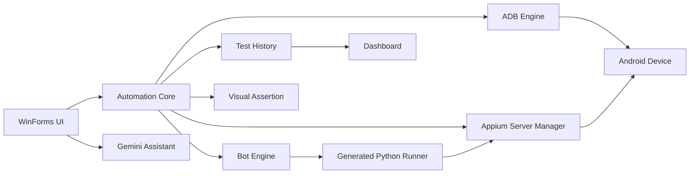

# Architecture

Appium Builder Reborn은 **Desktop UI**, **Android device control**, **Appium lifecycle**, **automation execution**, **result persistence**를 분리해 관리하는 구조를 사용합니다.

## 전체 구조



## 주요 컴포넌트

| 영역 | 주요 파일 | 책임 |
|---|---|---|
| ADB | `Core/AdbEngine.cs` | Device 탐지, 선택 Device routing, ADB command 실행 |
| Appium | `Core/AppiumServerManager.cs` | Server health check, 시작/종료, process ownership 관리 |
| 자동화 | `Core/BotEngine.cs` | Scenario를 실행 가능한 Python/Appium flow로 변환 |
| 결과 저장 | `Core/TestHistoryStore.cs` | Step/Run 이력 저장, backup, atomic replace |
| 시각 검증 | `Core/VisualAssertConfig.cs` | Baseline threshold와 dynamic mask 설정 |
| UI | `MainForm/*`, `UI/*` | WinForms 화면, responsive reflow, 공통 control |
| AI | `MainForm/MainFormGemini.cs` | UI dump redaction, Gemini 기반 scenario 생성 지원 |
| Dashboard | `Dashboard/*` | 저장된 test history를 요약해 표시 |

## 실행 흐름

```text
Device 탐지
  → Appium 상태 확인
  → Scenario 선택/작성
  → Bot Engine이 실행 스크립트 구성
  → Appium을 통해 Android Device 제어
  → Step별 결과/스크린샷/Visual Assert 기록
  → TestHistoryStore 저장
  → UI 및 Dashboard에서 결과 확인
```

## Process ownership

Appium Server는 단순히 port가 열려 있는지만 보는 것이 아니라, **현재 Application이 시작한 process인지 외부에서 시작된 process인지 구분**합니다.

- 외부 Appium Server가 이미 동작 중이면 그대로 사용합니다.
- Appium Builder가 시작한 Server만 종료 대상이 됩니다.
- Bot 실행 전 `/status` endpoint를 확인하여 실행 가능 상태를 판단합니다.

이 방식은 개발자가 별도로 띄워 둔 Appium 환경을 Application이 임의로 종료하지 않도록 하기 위한 설계입니다.
